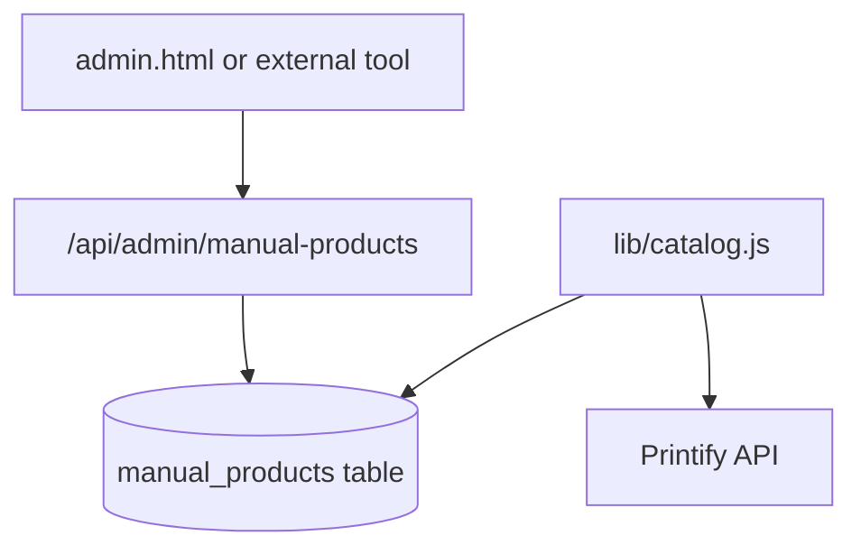

# Phase 2: Manual product admin (future)

Use this when editing [`data/manual-products.js`](../data/manual-products.js) and redeploying feels too slow.

## Goal

Add, edit, and unpublish manual products **without a git commit**, via a protected admin API backed by Cloudflare D1.

Printify products stay unchanged (still pulled from Printify API + `site-live` tag).

## Architecture

## Database

Schema: [`migrations/002_manual_products.sql`](../migrations/002_manual_products.sql)

Each row stores the same JSON fields as [`data/manual-products.js`](../data/manual-products.js) (`images_json`, `options_json`, `variants_json`).

## Suggested implementation

1. **D1 binding** — add to [`wrangler.toml`](../wrangler.toml) (same or separate DB from orders).
2. **`lib/manual-products-d1.js`** — `loadManualProductsFromD1(db)` returning normalized products (same shape as file loader).
3. **Update [`lib/catalog.js`](../lib/catalog.js)** — merge Printify + file catalog + D1 catalog (file can remain for seed/fallback).
4. **Protected API routes** (require `ADMIN_API_KEY` secret):
   - `GET /api/admin/manual-products` — list all
   - `POST /api/admin/manual-products` — create
   - `PUT /api/admin/manual-products/:id` — update
   - `DELETE /api/admin/manual-products/:id` — remove
5. **Optional `admin.html`** — simple form: title, price, image URL, published toggle (no file upload v1; paste image URL or upload to `/assets/` separately).

## Auth options

| Method | Pros |
|--------|------|
| `ADMIN_API_KEY` header | Simple, works with curl/Postman |
| Cloudflare Access | Browser login, no shared key in client |

Do not expose admin routes without authentication.

## Migration path from file catalog

1. Deploy D1 schema.
2. One-time script: import entries from `data/manual-products.js` into D1.
3. Switch catalog loader to prefer D1; keep file as read-only fallback during transition.
4. Document that new products go through admin only.

## Out of scope for Phase 2 v1

- Image upload to R2 (use `/assets/` + git or external CDN URL first)
- Shopify / headless CMS integration
- Editing Printify products from admin
